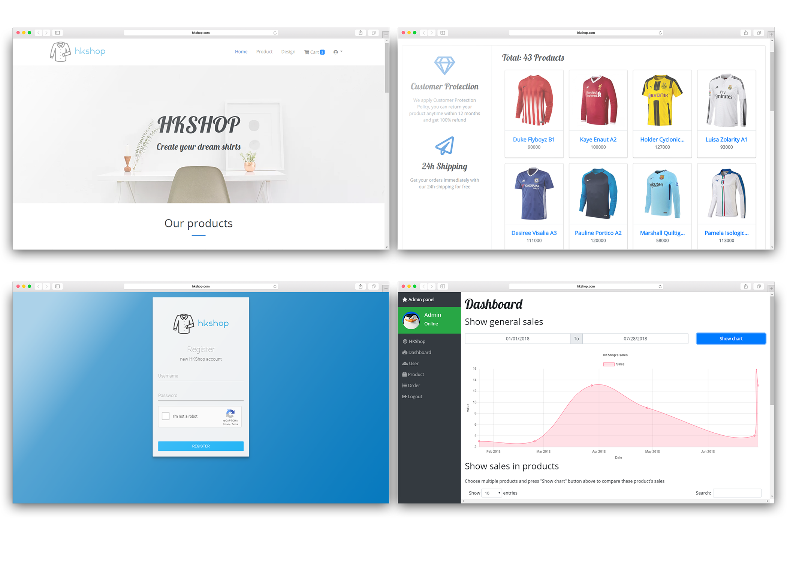

# HKShop Web Project
This is a school project for a full-stack responsive shopping website using NodeJS and Handlebars view engine.
## Core features
* Responsive layout
* Store data using MongoDB (MongooseJS)
* Authenticate using PassportJS
* Store cart in session
* Custom design product
* Typical shopping web features
* Sandbox payment using Paypal
* Sandbox payment using OnePay (Vietnam)
* Admin panel for data management
* RESTFul API for data management
* API Authenticated using Json Web Token
## Run the project
* Clone the project
* Enter your mongodb connection string in server.js
* Enter your Google captcha secret key in user.js (optional)
* Enter your Paypal client ID and secret key in payment.js (optional)
* Run node seed/product-seeder.js to initialize fake data
* npm install
* npm start
## Website's photos
 
